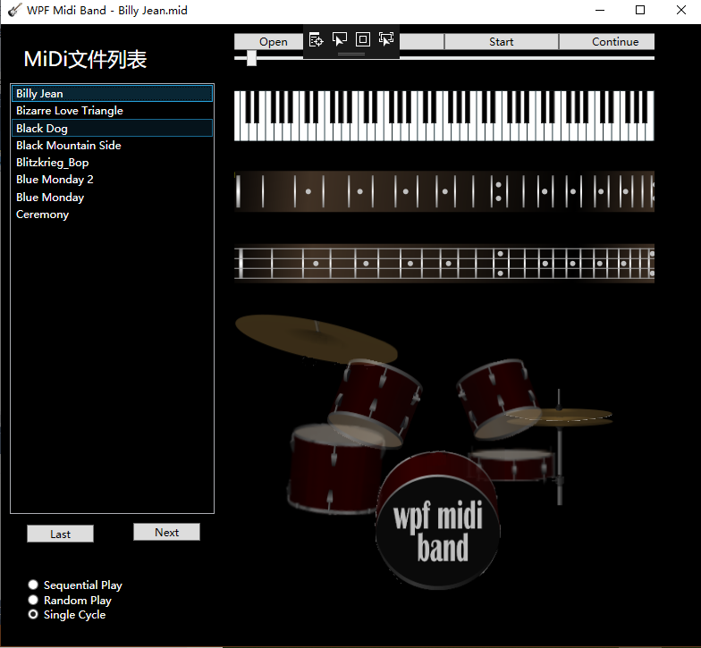

## 《WPF实现MIDI乐队APP》
      学院：软件学院  班级：4 班    学号：3017218181  姓名：郑万杰
      日期：   2019年  4月 11 日
# 一、功能概述
       一个简单的Midi文件播放器，一次在播放列表中添加多个文件，可以设置不同的播放顺序。用户可以通过点击上一曲(Last)、下一曲(Next)
进行当前播放曲目的切换
# 二、项目特色
    1.添加一个列表，可以在列表中显示Midi文件名
    2.通过对原有WPF项目的更改，实现列表播放、顺序播放、单曲循环
    3.对原有界面进行完善和拓展，新增界面控件与原有界面不会相互影响。界面大小变化不会发生界面变得丑陋的情况。
# 三、代码总量
      这个项目的优化跟之前的实验二的的修改差不多,代码总量大概150行。
# 四、工作时间
      1天
# 五、运行截图

      通过Open按钮弹出的文件选择对话框打开多个文件，将文件添加到播放列表中,单击其中的某个文件,就会自动播放。三个单选框用来设置列表中文件的播放顺序。新增通过点击Last跟Next，切换正在播放的文件。播放完成之后，会根据单选
框中选定的播放设置进行播放。如果没有选择单选按钮，默认是单曲循环。
# 六、结论
    1.通过这次实验，对WPF编程的界面设计进行了学习，我通过Grid将界面分成两列，第一列放新增加的控件，第二列放之前的界面。
	2.利用ListBox的SelectionChanged事件，可以实现更改了播放列表中的选定项，就播放选中的这个文件。
	3.实验二的Last跟Next按钮的Click事件写的有点复杂，在这次实验中，我只要在这两个按钮中把ListBox的SelectIndex修改，就会触发
ListBox的SelectionChanged事件。
    4.当文件播放完之后，利用异步将播放下一曲的执行代码添加到主界面线程中，这是因为HandlePlayingCompleted代码块不是由主界面线程执行的，而执行
播放的代码不能由非主界面线程执行，那就利用MainWindow的Dispatcher的BeginInvoke()方法将播放代码块发给主界面线程。